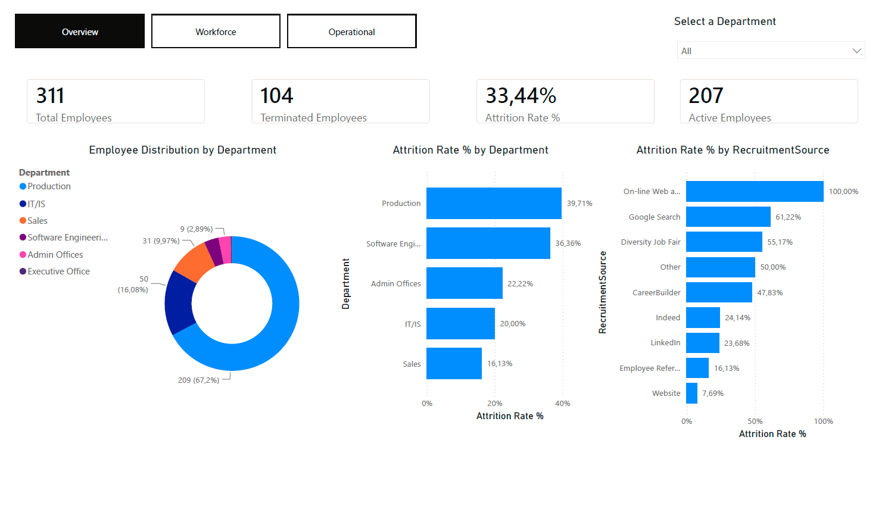
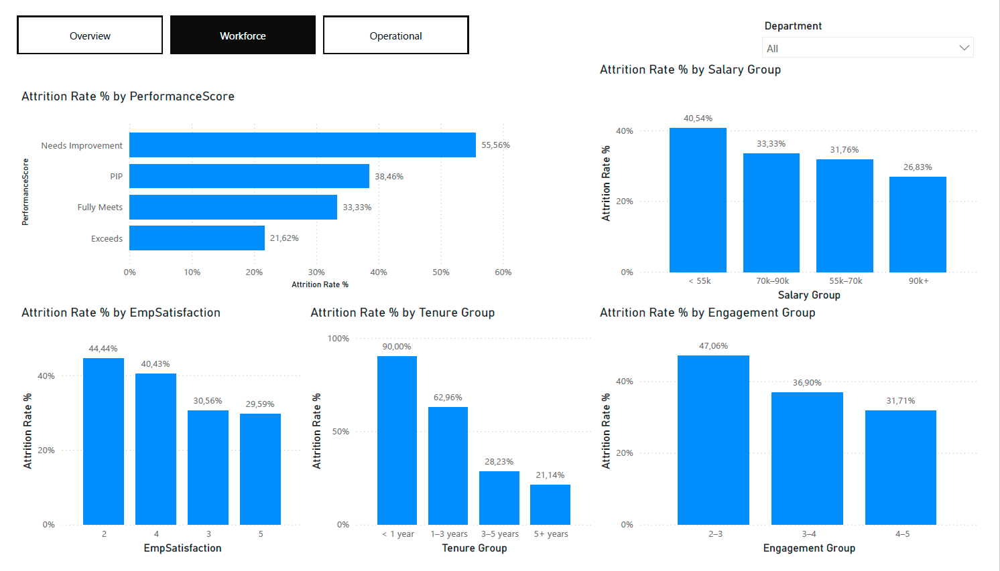
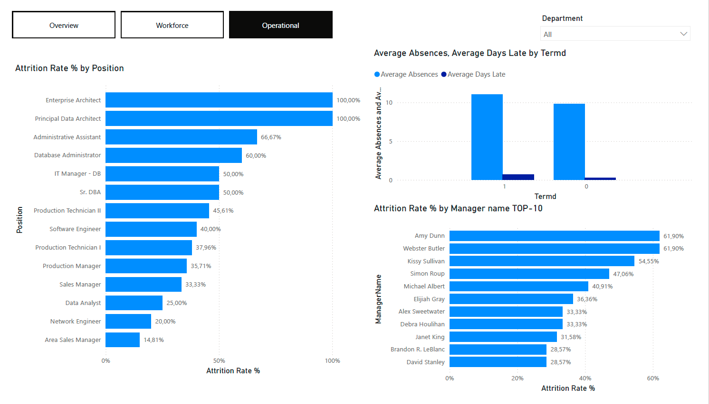

# HR Attrition Analysis — What Drives Employee Attrition?

## Project Summary

This project analyzes employee attrition patterns using SQL for data aggregation and Power BI for visualization.

The analysis explores how department, tenure, performance, satisfaction, salary, recruitment source, management, and attendance relate to employee turnover.

The goal is to identify key drivers of attrition and demonstrate how HR data can support evidence-based workforce decisions.

---

## Dataset

- **Source:** HRDataset_v14 by Dr. Rich Huebner (public HR dataset)
- **Records:** 311 employees
- **Fields Used:** Department, Position, DateOfHire, DateOfTermination, Termd, PerformanceScore, EmpSatisfaction, EngagementSurvey, Salary, RecruitmentSource, ManagerName, Absences, DaysLateLast30

---

## Business Questions

1. What is the overall employee attrition rate?
2. What is the attrition rate by department?
3. What is the attrition rate by job role?
4. How does employee tenure relate to attrition?
5. Does employee performance affect attrition?
6. Does employee satisfaction affect attrition?
7. Does salary affect attrition?
8. Which recruitment sources are associated with the highest and lowest attrition?
9. How does employee engagement relate to attrition?
10. Which managers have the highest employee turnover?
11. Are absences and lateness associated with attrition?

---

## Tools Used

- **DBeaver** — SQL querying and data exploration
- **SQL** — attrition rate calculations and business question analysis
- **Power BI** — dashboard development and visualization
- **DAX** — KPI and attrition rate calculations
- **Power Query** — data preparation and transformation

---

## Approach

Attrition rate and related metrics were calculated directly in SQL for each business question, including:

- Overall attrition rate
- Attrition by department
- Attrition by position
- Attrition by tenure group
- Attrition by performance score
- Attrition by employee satisfaction
- Attrition by salary band
- Attrition by recruitment source
- Attrition by manager
- Attrition by engagement level

Additional analysis was performed to evaluate attendance indicators such as absences and lateness.

The SQL outputs were then visualized in Power BI through a three-page dashboard designed to answer three key questions:

- **Overview:** What is happening?
- **Workforce:** Why is it happening?
- **Operational:** Where should the organization investigate further?

---

## Key Insights

### 1. Attrition Is Primarily an Early Employee Lifecycle Challenge

Employees with less than one year of tenure experienced an attrition rate of **90.0%**, compared to **21.1%** among employees with more than five years of service.

This represents the strongest relationship observed in the analysis and suggests that turnover risk is heavily concentrated during the early stages of employment. Rather than indicating a general retention problem across the workforce, the findings point to onboarding quality, expectation alignment, manager integration, and early employee experience as potential areas for further investigation.

*Business implication: The organization may be losing employees before realizing the full return on recruitment, onboarding, and training investments.*

---

### 2. Recruitment Outcomes Should Be Evaluated Beyond Hiring Volume

Attrition rates varied significantly across recruitment sources, ranging from **7.7%** for Website hires to **61.2%** for Google Search hires.

However, additional analysis suggests that recruitment channels may be associated with different workforce segments and job types. For example, almost **88% of employees hired through Google Search were Production Technicians** — a workforce segment that has historically experienced higher turnover than many other employee groups.

This finding highlights the importance of distinguishing recruitment-source effects from workforce composition effects before drawing conclusions about channel performance.

*Business implication: Recruitment effectiveness should be measured using quality-of-hire and retention outcomes, not hiring volume alone.*

---

### 3. Attrition Risk Is Concentrated in Specific Workforce Segments

Attrition was not evenly distributed across the organization.

**Production** and **Software Engineering** demonstrated the highest attrition rates among all departments, suggesting that turnover challenges may be concentrated within specific workforce segments rather than affecting the organization uniformly.

Differences were also observed across positions and managerial teams, indicating that workforce stability may be influenced by local operational conditions, workforce composition, management practices, or team-level factors.

*Business implication: Company-wide retention initiatives may be less effective than targeted interventions focused on high-risk employee groups.*

---

### 4. Compensation Appears Related to Retention, but Is Unlikely to Be the Primary Driver

Lower-paid employee groups generally demonstrated higher attrition rates than higher-paid employee groups.

However, the relationship was less pronounced than the differences observed across tenure groups and may partially reflect differences in role type, seniority level, and workforce composition.

The findings suggest that compensation contributes to retention outcomes but is unlikely to fully explain employee turnover patterns on its own.

*Business implication: Compensation should be evaluated as part of a broader retention strategy rather than as a standalone solution.*

---

### 5. Behavioral Indicators May Help Identify Emerging Retention Risk

Employees who left the organization demonstrated higher levels of lateness than active employees.

While attendance metrics should not be interpreted as a direct cause of turnover, they may serve as early indicators of disengagement and potential retention risk.

The findings suggest that behavioral patterns can provide valuable signals before attrition actually occurs.

*Business implication: Workforce monitoring should focus not only on outcomes but also on leading indicators of employee disengagement.*

---

## Business Interpretation

The analysis suggests that employee turnover should be viewed primarily as a workforce lifecycle challenge rather than a compensation challenge alone.

The strongest attrition patterns were observed during the first year of employment, indicating that early employee experience may play a critical role in long-term retention outcomes. Employees appear to be at greatest risk before becoming fully integrated into the organization and before the company realizes the full value of its hiring and onboarding investments.

The findings also suggest that workforce stability varies across recruitment channels, departments, positions, and managerial teams. This indicates that retention challenges are unlikely to stem from a single root cause and may instead reflect a combination of workforce composition, role characteristics, management practices, and employee experience factors.

One example is the relationship between recruitment source and attrition. Initial results suggested that Google Search hires experienced substantially higher turnover. However, further analysis showed that the majority of these hires belonged to a single workforce segment (Production Technicians), highlighting the importance of considering workforce composition before attributing outcomes to a recruitment channel itself.

Importantly, several observed relationships may be influenced by workforce composition effects. Similar considerations may apply to department, salary, and manager-level findings.

Overall, the results indicate that employee turnover is best understood as a multifactor workforce issue requiring targeted analysis and intervention rather than a single organization-wide solution.

---

## Recommendations

### 1. Review the First-Year Employee Experience

Conduct a structured analysis of the employee journey during the first year of employment, including recruitment, onboarding, probation, and manager integration stages.

The objective should be to identify where turnover risk is highest and which experiences contribute most to early employee exits.

---

### 2. Introduce Quality-of-Hire Metrics

Evaluate recruitment channels using a combination of hiring volume, retention outcomes, and employee performance measures.

Recruitment effectiveness should be assessed based on long-term workforce outcomes rather than acquisition metrics alone.

---

### 3. Focus on High-Risk Workforce Segments

Prioritize retention analysis and intervention efforts within departments, positions, and teams demonstrating elevated attrition levels.

Targeted actions are likely to be more effective than broad organization-wide retention initiatives.

---

### 4. Investigate Workforce Composition Drivers

Conduct additional analysis within individual job families and departments to determine whether observed attrition patterns are driven by recruitment channels, role characteristics, management practices, compensation structures, or other workforce factors.

This will help distinguish correlation from underlying causes.

---

### 5. Monitor Leading Indicators of Turnover Risk

Regularly track attendance, engagement, satisfaction, and other workforce indicators that may signal emerging retention challenges.

Early identification of at-risk employee groups can support proactive intervention before turnover occurs.
---

## Dashboard Preview

### Overview

### Workforce

### Operational

---

## Files in This Repository

- `hr_attrition_analysis.sql` — SQL queries used to answer the 11 business questions
- `HR_Attrition_Dashboard.pbix` — interactive Power BI dashboard
- `README.md` — project documentation

---

## Skills Demonstrated

### HR Analytics

- Employee attrition analysis
- Retention metrics
- Workforce analytics
- HR KPI development
- Evidence-based HR decision support

### SQL

- Aggregation and grouping (`GROUP BY`)
- Conditional logic (`CASE WHEN`)
- Date calculations (`DATEDIFF`)
- Data transformation
- HR metric calculation
- Workforce segmentation and analysis
- Business-focused analytical queries

### Power BI

- Interactive dashboard development
- KPI visualization
- Multi-page report design
- Data storytelling

### DAX

- Attrition rate calculations
- KPI measures
- Custom metrics

### Power Query

- Data preparation
- Data transformation
- Data type management

### Business Analytics

- Translating business questions into analytical frameworks
- Identifying workforce trends and retention risks
- Developing data-driven recommendations

---

## Conclusion

This project demonstrates how HR data can be used to identify employee retention risks and support workforce decision-making.

The analysis found that attrition is primarily concentrated among employees with short tenure, while recruitment source, department, compensation, engagement, and team-level characteristics appear to influence long-term retention outcomes.

By combining SQL, Power BI, DAX, and HR domain knowledge, the project illustrates a complete HR Analytics workflow—from business questions and data preparation to insight generation and actionable recommendations.
